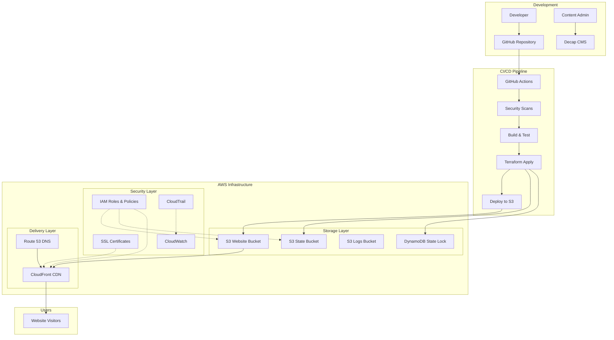

# Design Document: ECOF Website

## Overview

The ECOF website is a secure, high-performance static website built with Astro and TypeScript, deployed on AWS infrastructure managed by Terraform. The architecture emphasizes security through defense-in-depth principles, with secure state management, encrypted storage, and comprehensive access controls.

The system follows a JAMstack architecture with static site generation, headless CMS, and cloud-native deployment. Security is integrated at every layer, from infrastructure provisioning to content delivery.

## Architecture

### High-Level Architecture



### Security Architecture

The security architecture implements multiple layers of protection:

1. **Infrastructure Security**: Terraform state encryption, IAM least privilege, VPC isolation
2. **Application Security**: HTTPS enforcement, security headers, input validation
3. **Data Security**: Encryption at rest and in transit, secure backup strategies
4. **Access Security**: Multi-factor authentication, role-based access control
5. **Monitoring Security**: Comprehensive logging, alerting, and audit trails

## Components and Interfaces

### Frontend Components

#### Static Site Generator (Astro)
- **Purpose**: Builds optimized static HTML/CSS/JS from TypeScript source
- **Key Features**: 
  - TypeScript support for type safety
  - Component-based architecture
  - Automatic code splitting and optimization
  - SEO-friendly static generation
- **Security Considerations**: 
  - Content Security Policy headers
  - XSS protection through template escaping
  - Dependency vulnerability scanning

#### Content Management Interface (Decap CMS)
- **Purpose**: Provides web-based content editing for club administrators
- **Authentication**: GitHub OAuth integration
- **Content Types**: 
  - Ride information (sorties)
  - Route details (parcours)
  - Club information (a-propos)
- **Security Features**:
  - OAuth-based authentication
  - Git-based content versioning
  - Role-based content access

### Infrastructure Components

#### Terraform State Management
- **Remote Backend**: S3 bucket with encryption and versioning
- **State Locking**: DynamoDB table for concurrent access prevention
- **Security Features**:
  - Server-side encryption with AWS KMS
  - Bucket versioning for state history
  - Access logging for audit trails
  - Cross-region replication for disaster recovery

```hcl
terraform {
  backend "s3" {
    bucket         = "ecof-terraform-state"
    key            = "website/terraform.tfstate"
    region         = "eu-west-1"
    encrypt        = true
    dynamodb_table = "ecof-terraform-locks"
    kms_key_id     = "arn:aws:kms:eu-west-1:ACCOUNT:key/KEY-ID"
  }
}
```

#### AWS Infrastructure Components

**S3 Buckets**:
- Website hosting bucket with public read access via CloudFront only
- Terraform state bucket with strict access controls
- Logs bucket for access and audit logging
- All buckets encrypted with AWS KMS

**CloudFront Distribution**:
- Global content delivery network
- SSL/TLS termination with ACM certificates
- Security headers injection
- DDoS protection via AWS Shield
- Web Application Firewall (WAF) integration

**IAM Security Model**:
- Service-specific roles with minimal permissions
- Cross-account access controls
- MFA enforcement for administrative actions
- Regular access key rotation

### Data Models

#### Content Models

```typescript
interface RideEvent {
  id: string;
  title: string;
  date: Date;
  description: string;
  difficulty: 'beginner' | 'intermediate' | 'advanced';
  distance: number;
  meetingPoint: string;
  route?: RouteReference;
}

interface Route {
  id: string;
  name: string;
  description: string;
  distance: number;
  elevation: number;
  difficulty: 'beginner' | 'intermediate' | 'advanced';
  gpxFile?: string;
  mapImage?: string;
}

interface ClubInfo {
  section: string;
  title: string;
  content: string;
  lastUpdated: Date;
}
```

#### Infrastructure Models

```typescript
interface TerraformState {
  version: number;
  terraform_version: string;
  serial: number;
  lineage: string;
  outputs: Record<string, any>;
  resources: TerraformResource[];
}

interface SecurityConfiguration {
  encryption: {
    kmsKeyId: string;
    algorithm: 'AES256' | 'aws:kms';
  };
  access: {
    principalArns: string[];
    conditions: Record<string, any>;
  };
  monitoring: {
    cloudTrailEnabled: boolean;
    accessLoggingBucket: string;
  };
}
```

## Correctness Properties

*A property is a characteristic or behavior that should hold true across all valid executions of a system—essentially, a formal statement about what the system should do. Properties serve as the bridge between human-readable specifications and machine-verifiable correctness guarantees.*

### Property 1: Static Site Generation with TypeScript
*For any* valid source code repository, the Static Site Generator should produce optimized static files using Astro framework with TypeScript compilation artifacts
**Validates: Requirements 1.1**

### Property 2: Responsive Content Display
*For any* viewport size, the website should render cycling club content appropriately with responsive layout adjustments
**Validates: Requirements 1.2**

### Property 3: Content Update Rebuilds
*For any* content modification, the Static Site Generator should detect changes and produce updated static output files
**Validates: Requirements 1.4**

### Property 4: CMS Authentication Security
*For any* administrator login attempt, the Content Management System should enforce secure authentication methods and protocols
**Validates: Requirements 2.2**

### Property 5: CMS Content Management
*For any* content type (rides, routes, club pages), the Content Management System should allow editing and saving with proper validation
**Validates: Requirements 2.3, 2.5**

### Property 6: CMS Repository Integration
*For any* content save operation, the Content Management System should create corresponding repository commits with proper metadata
**Validates: Requirements 2.4**

### Property 7: Terraform State Security
*For any* Terraform state operation, the Infrastructure Manager should store state in encrypted S3 storage with DynamoDB locking enabled
**Validates: Requirements 3.1, 3.2**

### Property 8: IAM Least Privilege
*For any* AWS service or user, the Security Manager should create IAM roles and policies with minimal required permissions only
**Validates: Requirements 3.4, 8.1, 8.2**

### Property 9: Infrastructure Security Best Practices
*For any* AWS resource provisioning, the Infrastructure Manager should apply security configurations including encryption, access controls, and monitoring
**Validates: Requirements 3.3, 3.5**

### Property 10: SSL/TLS Certificate Management
*For any* domain, the Security Manager should provision and automatically renew SSL/TLS certificates through AWS Certificate Manager
**Validates: Requirements 4.1, 4.3**

### Property 11: HTTPS Enforcement
*For any* website request, the system should enforce HTTPS connections and redirect HTTP traffic to HTTPS
**Validates: Requirements 4.2, 4.4**

### Property 12: Modern TLS Configuration
*For any* TLS connection, the Security Manager should use modern protocols and secure cipher suites
**Validates: Requirements 4.5**

### Property 13: CloudFront Global Distribution
*For any* static asset request, the Content Delivery Network should serve content from geographically distributed edge locations with appropriate caching
**Validates: Requirements 5.1, 5.2, 5.3**

### Property 14: Content Optimization and Security
*For any* content delivery, the CDN should apply compression, security headers, and DDoS protection
**Validates: Requirements 5.4, 5.5**

### Property 15: S3 Security Configuration
*For any* S3 bucket, the Security Manager should block public access, enable encryption, configure least privilege policies, and enable logging and versioning
**Validates: Requirements 6.1, 6.2, 6.3, 6.4, 6.5**

### Property 16: Automated Deployment Pipeline
*For any* code change to main branch, the Deployment Pipeline should automatically trigger with security scans, build/test, infrastructure deployment, and content deployment
**Validates: Requirements 7.1, 7.2, 7.3, 7.4, 7.5**

### Property 17: CloudTrail and MFA Security
*For any* AWS account, the Security Manager should enable CloudTrail logging and configure MFA requirements for administrative access
**Validates: Requirements 8.3, 8.4**

### Property 18: Comprehensive Monitoring
*For any* AWS service, the Security Manager should enable CloudWatch logging, configure security alerts, enable AWS Config, and set up monitoring dashboards with proper log retention
**Validates: Requirements 9.1, 9.2, 9.3, 9.4, 9.5**

### Property 19: Disaster Recovery Configuration
*For any* critical data store, the Infrastructure Manager should enable cross-region replication and automated backup processes
**Validates: Requirements 10.1, 10.2**

### Property 20: Infrastructure as Code Completeness
*For any* infrastructure component, the Infrastructure Manager should maintain complete Terraform definitions for reproducible deployment
**Validates: Requirements 10.5**

## Error Handling

### Infrastructure Errors
- **Terraform State Conflicts**: DynamoDB locking prevents concurrent state modifications
- **AWS Service Failures**: Retry logic with exponential backoff for transient failures
- **Certificate Provisioning Failures**: Automatic retry and alerting for ACM certificate issues
- **Deployment Failures**: Rollback mechanisms for failed deployments

### Application Errors
- **Build Failures**: Clear error reporting and build artifact cleanup
- **Content Validation Errors**: Schema validation for CMS content with user-friendly error messages
- **Authentication Failures**: Secure error handling without information disclosure

### Security Error Handling
- **Access Denied**: Proper logging without exposing sensitive information
- **Certificate Expiration**: Automated renewal with alerting for manual intervention needs
- **Security Scan Failures**: Deployment blocking for critical security issues

## Testing Strategy

### Dual Testing Approach
The testing strategy employs both unit testing and property-based testing for comprehensive coverage:

- **Unit tests**: Verify specific examples, edge cases, and error conditions for individual components
- **Property tests**: Verify universal properties across all inputs using randomized testing
- Both approaches are complementary and necessary for complete system validation

### Unit Testing Focus Areas
- Terraform module validation with specific configuration examples
- Astro component rendering with known content inputs
- CMS integration points with mock authentication
- AWS resource configuration validation
- Security policy compliance checks

### Property-Based Testing Configuration
- **Testing Library**: Use Terraform's built-in testing framework and Jest for application testing
- **Minimum Iterations**: 100 iterations per property test to ensure comprehensive input coverage
- **Test Tagging**: Each property test references its corresponding design document property
- **Tag Format**: **Feature: ecof-website, Property {number}: {property_text}**

### Infrastructure Testing
- **Terraform Plan Validation**: Automated testing of infrastructure changes before apply
- **Security Compliance Testing**: Automated checks for AWS security best practices
- **Performance Testing**: CloudFront cache hit rates and response time validation
- **Disaster Recovery Testing**: Automated backup and restore validation

### Security Testing
- **Vulnerability Scanning**: Automated dependency and infrastructure vulnerability scans
- **Penetration Testing**: Regular security assessments of deployed infrastructure
- **Compliance Validation**: Automated checks against security frameworks
- **Access Control Testing**: Validation of IAM policies and S3 bucket permissions

### Integration Testing
- **End-to-End Deployment**: Full pipeline testing from code commit to production deployment
- **CMS Integration**: Content creation and publication workflow testing
- **CDN Integration**: Content delivery and cache invalidation testing
- **Monitoring Integration**: Alert and logging system validation