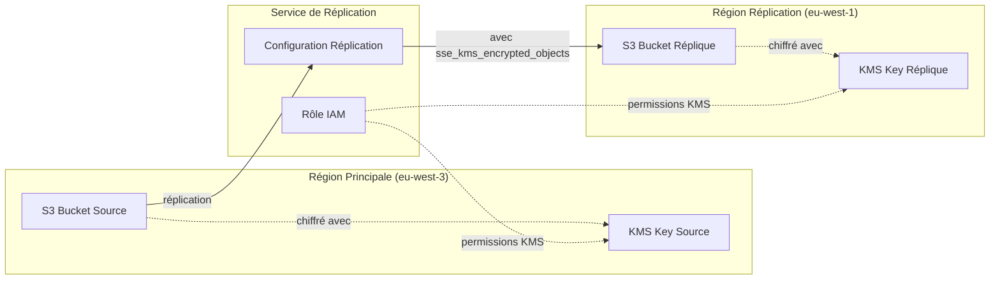

# Correction de la Réplication S3 avec Chiffrement KMS

## Problème identifié

L'erreur `SseKmsEncryptedObjects must be specified if EncryptionConfiguration is present` indique que la configuration de réplication S3 est incomplète pour les objets chiffrés avec KMS.

## Explication technique

Quand on configure la réplication S3 avec :
1. **Chiffrement KMS sur le bucket source**
2. **Chiffrement KMS sur le bucket de destination**

AWS exige de spécifier explicitement comment gérer les objets chiffrés avec KMS dans la réplication.

## Configuration corrigée

### Avant (incorrecte)
```hcl
resource "aws_s3_bucket_replication_configuration" "terraform_state" {
  rule {
    destination {
      encryption_configuration {
        replica_kms_key_id = aws_kms_key.terraform_state_replica.arn
      }
    }
  }
}
```

### Après (correcte)
```hcl
resource "aws_s3_bucket_replication_configuration" "terraform_state" {
  rule {
    # ✅ Configuration ajoutée pour les objets chiffrés KMS
    source_selection_criteria {
      sse_kms_encrypted_objects {
        status = "Enabled"
      }
    }

    destination {
      encryption_configuration {
        replica_kms_key_id = aws_kms_key.terraform_state_replica.arn
      }
    }
  }
}
```

## Améliorations de sécurité ajoutées

### 1. Chiffrement du bucket de réplication
```hcl
resource "aws_s3_bucket_server_side_encryption_configuration" "terraform_state_replica" {
  provider = aws.replica
  bucket   = aws_s3_bucket.terraform_state_replica.id

  rule {
    apply_server_side_encryption_by_default {
      kms_master_key_id = aws_kms_key.terraform_state_replica.arn
      sse_algorithm     = "aws:kms"
    }
    bucket_key_enabled = true
  }
}
```

### 2. Blocage de l'accès public sur la réplique
```hcl
resource "aws_s3_bucket_public_access_block" "terraform_state_replica" {
  provider = aws.replica
  bucket   = aws_s3_bucket.terraform_state_replica.id

  block_public_acls       = true
  block_public_policy     = true
  ignore_public_acls      = true
  restrict_public_buckets = true
}
```

## Flux de réplication sécurisé



## Permissions IAM requises

Le rôle de réplication a besoin des permissions suivantes :

### Sur le bucket source
- `s3:GetObjectVersionForReplication`
- `s3:GetObjectVersionAcl`
- `s3:GetObjectVersionTagging`
- `s3:ListBucket`

### Sur le bucket de destination
- `s3:ReplicateObject`
- `s3:ReplicateDelete`
- `s3:ReplicateTags`

### Sur les clés KMS
- `kms:Decrypt` (clé source)
- `kms:GenerateDataKey` (clé destination)

## Test de la configuration

Après correction, vous pouvez tester :

```bash
# 1. Valider la configuration
terraform validate

# 2. Voir le plan
terraform plan

# 3. Appliquer
terraform apply

# 4. Tester la réplication (après déploiement)
aws s3 cp test-file.txt s3://ecof-terraform-state-secure/test/
aws s3 ls s3://ecof-terraform-state-replica/test/ --region eu-west-1
```

## Bonnes pratiques pour la réplication S3 avec KMS

### ✅ À faire
- Toujours spécifier `source_selection_criteria` avec KMS
- Utiliser des clés KMS différentes par région
- Configurer les permissions IAM appropriées
- Activer le versioning sur les deux buckets
- Bloquer l'accès public sur les deux buckets

### ❌ À éviter
- Omettre `sse_kms_encrypted_objects`
- Utiliser la même clé KMS dans différentes régions
- Permissions IAM trop larges
- Oublier le chiffrement sur le bucket de destination

## Monitoring de la réplication

Pour surveiller la réplication :

```bash
# Métriques CloudWatch
aws cloudwatch get-metric-statistics \
  --namespace AWS/S3 \
  --metric-name ReplicationLatency \
  --dimensions Name=SourceBucket,Value=ecof-terraform-state-secure \
  --start-time 2024-01-01T00:00:00Z \
  --end-time 2024-01-02T00:00:00Z \
  --period 3600 \
  --statistics Average

# Status de réplication d'un objet
aws s3api head-object \
  --bucket ecof-terraform-state-secure \
  --key terraform.tfstate \
  --query ReplicationStatus
```

Cette configuration assure une réplication sécurisée et chiffrée du state Terraform pour la disaster recovery.